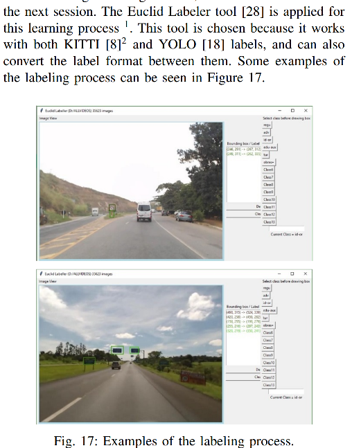

# euclid labeller, and euclidaug augment engine
Euclid object labeller for object detection training purposes based on Python. Tested on Linux, Windows, and Mac.

- Supports Kitti format
- Supports Yolo darknet format (Generates bounding boxes, as well as training list file)

Dynamic selection of format is now supported.

Optimised box selection using keyboard shortcuts.

# Typical object labelling workflow using Euclid:

Create a folder containing the images
 
- Ensure images are of uniform (not too big) shape using a command for resize like below. (Linux)

Resize all jpg images to 256x256, rename to sz-256-<original-name>.jpg

  `for file in *.jpg; do convert $file -resize 256x256 sz-256-$file; done`

- `$python euclid.py`

- Select the folder containing the images

- Euclid will show the first image in the folder.

- Select the class ID, and start labelling. Once done for this image, move to the next image, till all imagea are done.

- Euclid also generates a supplementary file "train.txt", containing the class ID and full path of training file. This can be used in YOLO format training.

# YOLO training and detection.

Refer below link for YOLO training and detection on Linux and Windows.

https://github.com/prabindh/darknet

Prebuilt binaries for Yolo are provided at https://github.com/prabindh/yolo-bins

# Euclidaug image augmentation engine

Lack of training images reduces training accuracy, when manual annotation is not an option. euclidaug serves to improve availability of training images, specially 2D.

Euclidaug can generate 1000s of annotated/labelled training images in minutes.

## Installing euclidaug

cd euclidaug

pip install -r requirements.txt

## Augmentation operations:

Random scaling, random packing, and random blending - are the operations performed on the images

## Purpose of euclidaug:

 To significantly augment availability of annotated data (# of images), specially 2D shapes for object recognition. Targeted for  Yolo

## How to run for example animal images (part of the tree):

(The images were taken from https://www.freeiconspng.com/img/1075, https://www.freeiconspng.com/img/1065, https://www.freeiconspng.com/img/1052)

Assuming euclid is cloned at c:\xxx, run the below command:

python euclidaug.py C:\xxx\euclid\euclidaug\sample-objects C:\xxx\euclid\euclidaug\sample-background C:\xxx\euclid\euclidaug\train-sample.txt

After seeing below, the augmented outputs will be generated in out_images and out_labels.

Info: Added [3] object images, Max obj/class of [1]
Info: Added [1] base images
Info: Beginning [11] images @ 0.421875 (sec)
...........
Info: Completed @ 0.265625 (sec)
 
 How to run adding new classes:
 - Place all object png images in a directory organised by IDs (for 3 classes, folders should be named as 0,1,2)
 - Place all background png images in a folder (can be any name)
 - Update cfgWidth, cfgHeight, numClasses - in the script, to match the framework requirements
 - Invoke this script as "python <script> <object-folder-name> <bg folder name> <training filename>"
 - output image files will be written to 'output-images' and 'output-labels' and training list file will be written
 
 - Note: The labels are in Yolo format, and output image files will be of same resolution as that of the "background" images.

# Dependencies

 Python 2.7
 `pip install pillow`
 `pip install image`
 Python 3
 Python 3 + Pillow on Ubuntu, do the below
 `sudo apt-get install python-imaging-tk`
 `sudo apt-get install python3-pil.imagetk`

# Converting to TensorFlow format
After labelling the images, the labels can be read and converted to TFRecord using Python scripts available in Tensorflow, using tf.train.Example and tf.train.Features. Note: Yolo and TF share the same bounding box notations (normalised).

# Who uses euclidaug (Thank you!)

https://hackaday.io/project/161581-ai-equiped-wasp-and-asian-hornet-sentry-gun/log/155557-processing-the-images

https://github.com/dpogosov/yolo_kfm

https://github.com/suji104

https://github.com/VanitarNordic

https://github.com/lesterlo (DetectNet with Nvidia)
among others
